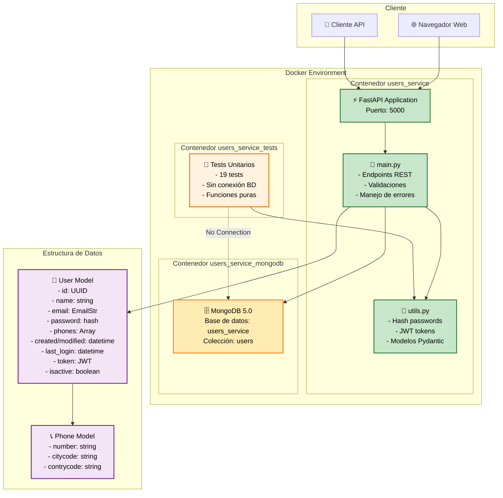

# User Service API - Prueba Técnica

## Descripción
API REST para gestión de usuarios con autenticación JWT, desarrollada con FastAPI y MongoDB.

## Características Implementadas
- ✅ CRUD completo de usuarios
- ✅ Validación de email y contraseña con regex
- ✅ Autenticación JWT
- ✅ Hash seguro de contraseñas con bcrypt
- ✅ Manejo de errores personalizado
- ✅ Tests unitarios (19 tests)
- ✅ Dockerización completa
- ✅ Soft delete de usuarios

## Ejecutar la Aplicación

### Abrir consola:

Despues de haber clonado el repositorio se debe abrir una consola en el directorio del repositorio(/prueba_tecnica_users_service)

### Docker Compose
```bash
docker-compose up users_service --build
```

## Ejecutar Tests
```bash
docker-compose --profile test up users_service_tests --build
```

## Endpoints API

**Base URL:** `http://localhost:5000`

- `POST /usuarios` - Crear usuario
- `GET /usuarios` - Listar usuarios  
- `GET /usuarios/{id}` - Obtener usuario
- `PUT /usuarios/{id}` - Actualizar usuario completo
- `PATCH /usuarios/{id}` - Actualizar usuario parcial
- `DELETE /usuarios/{id}` - Eliminar usuario (soft delete)

## Documentación Interactiva

La aplicación estará disponible en: **http://localhost:5000**

**Swagger UI (Recomendado):** http://localhost:5000/docs
- Interfaz interactiva para probar todos los endpoints
- Documentación automática generada por FastAPI
- Permite ejecutar requests directamente desde el navegador

## Notas Técnicas

### Decisiones de Implementación
1. **Secret Key**: Hardcodeada para simplicidad de evaluación.
2. **Base de datos**: MongoDB con conexión directa (en producción usaría connection pooling)
3. **Tests**: Framework unittest nativo (sin pytest para simplicidad)
4. **Docker**: Multi-stage build optimizado para desarrollo y testing

### Mejoras FUTURAS
- **Variables de entorno obligatorias**
- **🔒 Implementar validación de JWT en endpoints** (actualmente todos son públicos)
- Logging estructurado
- Rate limiting
- Health checks
- Métricas y monitoring con loki -grafana

## Tests Unitarios

- ✅ TestHashPassword (3 tests)
- ✅ TestCreateAccessToken (3 tests)  
- ✅ TestPhoneModel (2 tests)
- ✅ TestUserRequestModel (6 tests)
- ✅ TestUserUpdateRequestModel (5 tests)

**Total: 19 tests unitarios**
## Diagrama de la Solución

