# User Service API - Prueba Técnica

## Descripción
API REST para gestión de usuarios con autenticación JWT, desarrollada con FastAPI y MongoDB.

## Características Implementadas
- ✅ CRUD completo de usuarios
- ✅ Validación de email y contraseña con regex
- ✅ Autenticación JWT
- ✅ Hash seguro de contraseñas con bcrypt
- ✅ Manejo de errores personalizado
- ✅ Tests unitarios (19 tests)
- ✅ Dockerización completa
- ✅ Soft delete de usuarios

## Ejecutar la Aplicación

### Abrir consola:

Despues de haber clonado el repositorio se debe abrir una consola en el directorio del repositorio(/prueba_tecnica_users_service)

### Docker Compose
```bash
docker-compose up users_service --build
```

## Ejecutar Tests
```bash
docker-compose --profile test up users_service_tests --build
```

## Endpoints API

**Base URL:** `http://localhost:5000`

- `POST /usuarios` - Crear usuario
- `GET /usuarios` - Listar usuarios  
- `GET /usuarios/{id}` - Obtener usuario
- `PUT /usuarios/{id}` - Actualizar usuario completo
- `PATCH /usuarios/{id}` - Actualizar usuario parcial
- `DELETE /usuarios/{id}` - Eliminar usuario (soft delete)

## Documentación Interactiva

La aplicación estará disponible en: **http://localhost:5000**

**Swagger UI (Recomendado):** http://localhost:5000/docs
- Interfaz interactiva para probar todos los endpoints
- Documentación automática generada por FastAPI
- Permite ejecutar requests directamente desde el navegador

## Notas Técnicas

### Decisiones de Implementación
1. **Secret Key**: Hardcodeada para simplicidad de evaluación.
2. **Base de datos**: MongoDB con conexión directa (en producción usaría connection pooling)
3. **Tests**: Framework unittest nativo (sin pytest para simplicidad)
4. **Docker**: Multi-stage build optimizado para desarrollo y testing

### Mejoras FUTURAS
- **Variables de entorno obligatorias**
- **🔒 Implementar validación de JWT en endpoints** (actualmente todos son públicos)
- Logging estructurado
- Rate limiting
- Health checks
- Métricas y monitoring con loki -grafana

## Tests Unitarios

- ✅ TestHashPassword (3 tests)
- ✅ TestCreateAccessToken (3 tests)  
- ✅ TestPhoneModel (2 tests)
- ✅ TestUserRequestModel (6 tests)
- ✅ TestUserUpdateRequestModel (5 tests)

**Total: 19 tests unitarios**
## Diagrama de la Solución

```mermaid
graph TB
    subgraph "Cliente"
        Browser[🌐 Navegador Web]
        API_Client[📱 Cliente API]
    end

    subgraph "Docker Environment"
        subgraph "Contenedor users_service"
            FastAPI[⚡ FastAPI Application<br/>Puerto: 5000]
            Main[📄 main.py<br/>- Endpoints REST<br/>- Validaciones<br/>- Manejo de errores]
            Utils[🔧 utils.py<br/>- Hash passwords<br/>- JWT tokens<br/>- Modelos Pydantic]
        end
        
        subgraph "Contenedor users_service_tests"
            Tests[🧪 Tests Unitarios<br/>- 19 tests<br/>- Sin conexión BD<br/>- Funciones puras]
        end
        
        subgraph "Contenedor users_service_mongodb"
            MongoDB[🗄️ MongoDB 5.0<br/>Base de datos: users_service<br/>Colección: users]
        end
    end

    subgraph "Estructura de Datos"
        UserModel[👤 User Model<br/>- id: UUID<br/>- name: string<br/>- email: EmailStr<br/>- password: hash<br/>- phones: Array<br/>- created/modified: datetime<br/>- last_login: datetime<br/>- token: JWT<br/>- isactive: boolean]
        
        PhoneModel[📞 Phone Model<br/>- number: string<br/>- citycode: string<br/>- contrycode: string]
    end

    %% Conexiones
    Browser --> FastAPI
    API_Client --> FastAPI
    
    FastAPI --> Main
    Main --> Utils
    Main --> MongoDB
    
    Tests --> Utils
    Tests -.->|No Connection| MongoDB
    
    Main --> UserModel
    UserModel --> PhoneModel
    
    %% Estilos
    classDef container fill:#e1f5fe,stroke:#01579b,stroke-width:2px,color:#000000
    classDef service fill:#c8e6c9,stroke:#2e7d32,stroke-width:2px,color:#000000
    classDef database fill:#ffecb3,stroke:#f57f17,stroke-width:2px,color:#000000
    classDef model fill:#f3e5f5,stroke:#7b1fa2,stroke-width:2px,color:#000000
    classDef test fill:#fff3e0,stroke:#ef6c00,stroke-width:2px,color:#000000
    
    class FastAPI,Main,Utils service
    class MongoDB database
    class UserModel,PhoneModel model
    class Tests test
```

